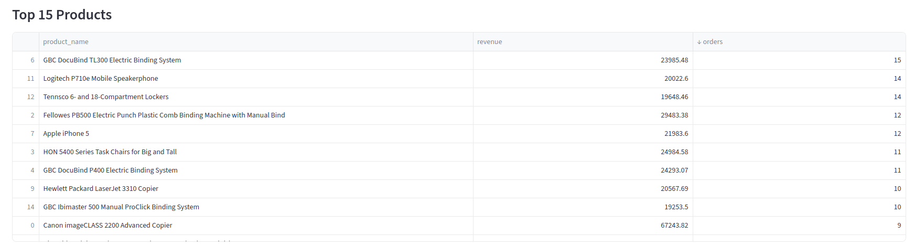
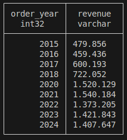

# Smart Sales Analyzer

A small end-to-end analytics playground: pull the Kaggle sales dataset (or reuse a cached copy), top it up with synthetic records, validate with Great Expectations, and stash the results in DuckDB for easy querying and a Streamlit front end.

## What You Get
- **Modern ETL**: Polars + DuckDB pipeline with Great Expectations validation.
- **Flexible sourcing**: Pulls the Kaggle dataset (or reuses the cached copy) and fills gaps with synthetic data.
- **Ready-to-query warehouse**: Materialised tables in `data/sales_analytics.duckdb`.
- **Interactive reporting**: Streamlit dashboard for quick demos.

## Quickstart

```bash
# 1) Clone and enter the project
cd smart_sales_analyzer

# 2) Create/activate a virtual environment (optional but recommended)
python3 -m venv .venv
source .venv/bin/activate

# 3) Install dependencies
pip install -r requirements.txt

# 4) (Optional) Export Kaggle credentials if you want to re-download the dataset
export KAGGLE_USERNAME=your_username
export KAGGLE_KEY=your_key
```

## Run the ETL

```bash
source .venv/bin/activate
python src/etl.py
```

Outputs land in `data/`:
- `train.csv` – cleansed Kaggle source (cached copy if Kaggle API is unavailable)
- `sales_enriched.parquet` – blended dataset with synthetic augmentation
- `regional_revenue.csv`, `segment_yearly.csv`, `top_products.csv`, `yearly.csv`
- `quality_report.json` – Great Expectations results
- `sales_analytics.duckdb` – DuckDB file with analytics tables
- `etl_pipeline.log` – run history

## Launch the Streamlit Dashboard

```bash
source .venv/bin/activate
streamlit run src/dashboard.py
```

Use the URL printed in the terminal to open the interactive report (filters, charts, KPIs).

## Explore DuckDB Tables via CLI

```bash
source .venv/bin/activate
python - <<'PY'
import duckdb

with duckdb.connect("data/sales_analytics.duckdb", read_only=True) as con:
    con.sql("SHOW TABLES FROM analytics").show()
    con.sql("""
        SELECT order_year, SUM(sales) AS revenue
        FROM analytics.sales
        GROUP BY 1
        ORDER BY 1
    """).show()
PY
```

More handy snippets for screenshots or demos:

```bash
source .venv/bin/activate
python - <<'PY'
import duckdb

with duckdb.connect("data/sales_analytics.duckdb", read_only=True) as con:
    con.sql("""
        SELECT COUNT(*) AS rows, SUM(sales) AS total_revenue
        FROM analytics.sales
    """).show()
    con.sql("""
        SELECT MIN(order_date) AS min_date, MAX(order_date) AS max_date
        FROM analytics.sales
    """).show()
    con.sql("""
        SELECT order_year, segment, revenue
        FROM analytics.segment_yearly_summary
        ORDER BY order_year, revenue DESC
    """).show()
    con.sql("""
        SELECT *
        FROM analytics.regional_revenue_summary
        ORDER BY revenue DESC
    """).show()
    con.sql("""
        SELECT *
        FROM analytics.top_products_summary
        ORDER BY revenue DESC
        LIMIT 15
    """).show()
PY
```

## Repository Layout

```
├── data/                     
│   ├── sales_analytics.duckdb
│   ├── sales_enriched.parquet
│   ├── *.csv (summary tables)
│   └── quality_report.json
├── src/
│   ├── etl.py                 
│   ├── dashboard.py           
│   └── synthetic_data_generator.py
├── requirements.txt
└── README.md
```

## Demo Shots
Drop your screenshots in `assets/` and reference them here. Examples from my run:

<p align="center">
  
</p>

<p align="center">
  
</p>

<p align="center">
  
</p>

<p align="center">
  
</p>

<p align="center">
  
</p>

<p align="center">
  
</p>

<p align="center">
  
</p>
